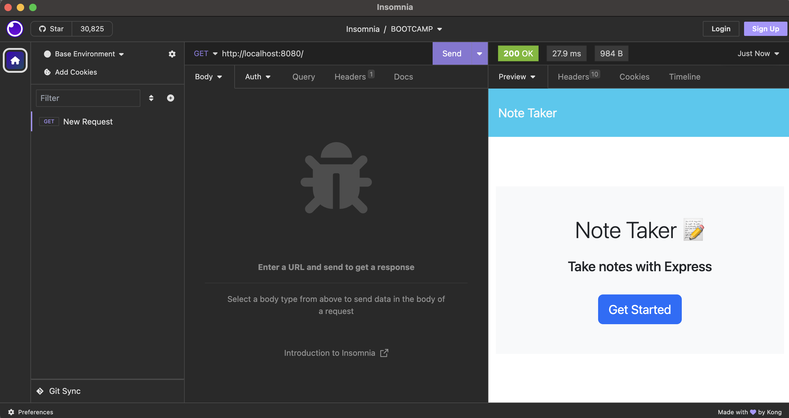

# note-taker

## Description
The motive behind this project was to create a note taker. It will save the user a ton of time organizing notes. I learned how to use express packages, run server through localhost ports, and create 'get' + 'post' routes.
 
## Installation
1. Clone from repo.
2. Open folder with visual studio code or any text editor of choice.
3. Run ‘node server ‘in terminal to run code.

## Usage
1. Open repo in terminal.
2. Run ‘node server’ to start application
3. Open corresponding localhost PORT using browser or Insomnia
4. ******

## Video Demo Link
[Click here for Demo Video]()